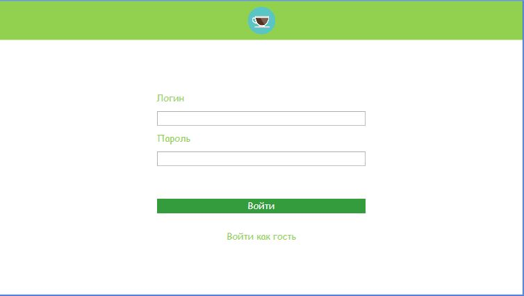
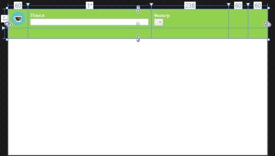
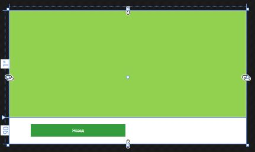
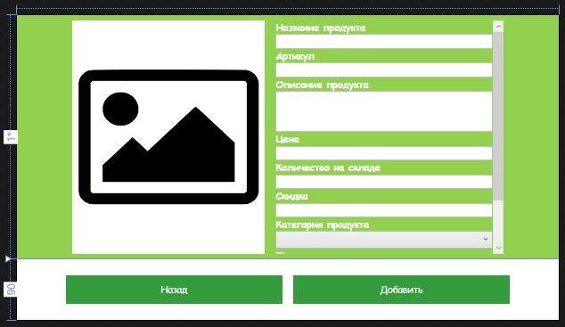
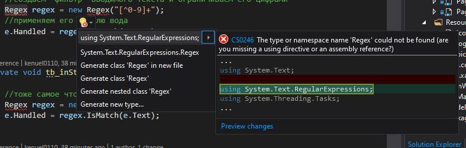
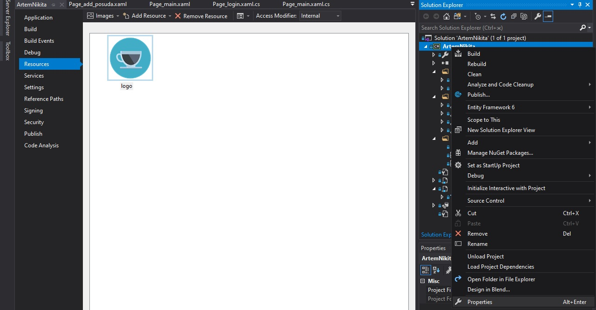

## Дополнительные данные

## ВАЖНО  

ПОСЛЕ СОЗДАНИЯ ПРОЕКТА СРАЗУ СДЕЛАТЬ РЕПОЗИТОРИЙ, ЧТОБЫ НЕ БЫЛО ПРОБЛЕМ
это можно сделать нажав ПКМ на "решение" и выбрать пункт "Добавить решение в систему управления версиями" или нажав тоже самое в нижнем правом углу окна visual studio

Лучше начинать смотреть в следующем порядке:  

Обязательная часть:
* Classes/Manager
* App.xaml (здесь храняться стили)
* MainWindow.xaml
* MainWindow.xaml.cs  
* Pages/Page_login.xaml  
* Pages/Page_login.xaml.cs
* Classes/Item_Posuda.cs  
* Pages/Page_main.xaml
* Pages/Page_main.xaml.cs  

Дополнительная часть:  
* Pages/Page_item.xaml
* Pages/Page_item.xaml.cs
* Pages/Page_add_posuda.xaml
* Pages/Page_add_posuda.xaml.cs

## Внешний вид страниц
|  |
|:--:|
| *Page_login* |

|  |
|:--:|
| *Page_main* |

|  |
|:--:|
| *Page_item* |

|  |
|:--:|
| *Page_add_posuda* |

## Мелкие моменты
Если есть какие-либо ошибки в коде, проверте прописали ли вы всё using, проверить это можно при помощи выделения слова и нажатия сочитания клавиш alt + enter или ПКМ и пункт с лампочкой. Если в поивившимся меню есть using , то выбирайте его и нажимайте enter
|  |
|:--:|
| *Пример отсутсвоющего using* |  

Просто если видите в начале using "кликайте"  

Главное что вы должны реализовать это:  
* Авторизация
* Главное окно  

Остальное, по степени понимания  

|  |
|:--:|
| *Добавление ресурсов* |

Добавление ресурсов происходит нажатием ПКМ по проекту, свойства, затем ресурсы и добавить существующий файл, затем в проекте появиться папка resorces и картинку можно добавлять в неё только, не забудте нажать на картинку, которые вы добавили и выбирите "действие при сборке" "ресурс"
